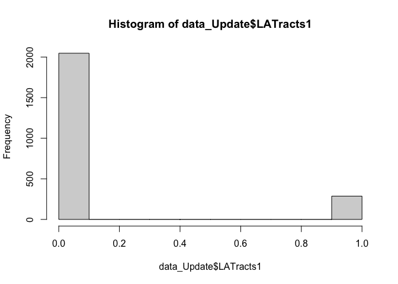

Midterm
================
Lily
2022-10-23

``` r
knitr::opts_chunk$set(echo = TRUE)
```

``` r
library(tidytext)
library(tidyverse)
```

    ## ── Attaching packages ─────────────────────────────────────── tidyverse 1.3.2 ──
    ## ✔ ggplot2 3.3.6     ✔ purrr   0.3.4
    ## ✔ tibble  3.1.8     ✔ dplyr   1.0.9
    ## ✔ tidyr   1.2.0     ✔ stringr 1.4.1
    ## ✔ readr   2.1.3     ✔ forcats 0.5.2
    ## ── Conflicts ────────────────────────────────────────── tidyverse_conflicts() ──
    ## ✖ dplyr::filter() masks stats::filter()
    ## ✖ dplyr::lag()    masks stats::lag()

``` r
library(dplyr)
library(ggplot2)
library(forcats)
library(leaflet)
library(readxl)
```

# Introduction

###### The University of Southern California is located in the heart of downtown Los Angeles. Despite its countless benefits as a university, USC does not offer students access to a healthy diet. The University is located in a food desert. A food desert can be described as an area where it is difficult to buy affordable, good-quality fresh food. Since the up-to-date contemporary university cannot provide their students with fresh, affordable goods, I’d like to see what areas of Los Angeles are not in a food desert and families have access to affordable foods.

-   Primary Question:
-   What percentage of Los Angeles County has access to affordable fresh
    foods as of 2019?
-   Secondary Questions:
-   What percentage of Los Angeles County is it hardest to obtain
    affordable fresh foods (greater than 20 miles) as of 2019?
-   What percentage of Los Angeles County is it easiest to obtain
    affordable fresh foods (less than one mile) as of 2019?

\# Methods

\###### My data was acquired from the USDA Economic Research Service
Website
(<https://www.ers.usda.gov/data-products/food-access-research-atlas/download-the-data/#Current%20Version>).

\## Read in data

``` r
data <- read_excel('2019FoodDataLAC.xlsx')
data
```

    ## # A tibble: 2,334 × 83
    ##    CensusTr…¹ State County Urban Pop2010 OHU2010 Group…² NUMGQ…³ PCTGQ…⁴ LILAT…⁵
    ##    <chr>      <chr> <chr>  <dbl>   <dbl>   <dbl>   <dbl> <chr>   <chr>     <dbl>
    ##  1 060371011… Cali… Los A…     1    4731    1641       0 88      1.8600…       0
    ##  2 060371011… Cali… Los A…     1    3664    1325       0 0       0             0
    ##  3 060371012… Cali… Los A…     1    5990    2150       0 55      0.9181…       0
    ##  4 060371012… Cali… Los A…     1    3363    1246       0 2       5.9470…       0
    ##  5 060371013… Cali… Los A…     1    4199    1542       0 49      1.1669…       0
    ##  6 060371014… Cali… Los A…     1    3903    1498       0 2       5.1242…       0
    ##  7 060371021… Cali… Los A…     1    1740     630       0 0       0             0
    ##  8 060371021… Cali… Los A…     1    3648    1279       0 212     5.8114…       0
    ##  9 060371021… Cali… Los A…     1    1731     527       0 0       0             1
    ## 10 060371021… Cali… Los A…     1    3851    1269       0 294     7.6343…       0
    ## # … with 2,324 more rows, 73 more variables: LILATracts_halfAnd10 <dbl>,
    ## #   LILATracts_1And20 <dbl>, LILATracts_Vehicle <dbl>, HUNVFlag <dbl>,
    ## #   LowIncomeTracts <dbl>, PovertyRate <dbl>, MedianFamilyIncome <chr>,
    ## #   LA1and10 <dbl>, LAhalfand10 <dbl>, LA1and20 <dbl>, LATracts_half <dbl>,
    ## #   LATracts1 <dbl>, LATracts10 <dbl>, LATracts20 <dbl>,
    ## #   LATractsVehicle_20 <dbl>, LAPOP1_10 <chr>, LAPOP05_10 <chr>,
    ## #   LAPOP1_20 <chr>, LALOWI1_10 <chr>, LALOWI05_10 <chr>, LALOWI1_20 <chr>, …

## Clean Data

``` r
### Header, footer, dimensions 
dim(data)
head(data)
tail(data)
### Taking a closer look at variables 
summary(is.na(data))
```

``` r
# Remove null  & NA values
data_Update <- data[
  !(
    is.na(data$MedianFamilyIncome) | data$MedianFamilyIncome==""
    | is.na(data$Urban) | data$Urban==""
    | is.na(data$LAPOP1_10) | data$LAPOP1_10==""
    | is.na(data$LAPOP05_10) | data$LAPOP05_10==""
    | is.na(data$LAPOP1_20) | data$LAPOP1_20==""
    | is.na(data$LALOWI1_10) | data$LALOWI1_10==""
    | is.na(data$LALOWI05_10) | data$LALOWI05_10==""
    | is.na(data$LALOWI1_20) | data$LALOWI1_20==""
    | is.na(data$lapophalf) | data$lapophalf==""
    | is.na(data$lapophalfshare) | data$lapophalfshare==""
    | is.na(data$lalowihalf) | data$lalowihalf==""
    | is.na(data$lalowihalfshare) | data$lalowihalfshare==""
    | is.na(data$lakidshalf) | data$lakidshalf==""
    | is.na(data$lakidshalfshare) | data$lakidshalfshare==""
    | is.na(data$laseniorshalf) | data$laseniorshalf==""
    | is.na(data$laseniorshalfshare) | data$laseniorshalfshare==""
    | is.na(data$lawhitehalf) | data$lawhitehalf==""
    | is.na(data$lawhitehalfshare) | data$lawhitehalfshare==""
    | is.na(data$lablackhalf) | data$lablackhalf==""
    | is.na(data$lablackhalfshare) | data$lablackhalfshare==""
    | is.na(data$laasianhalf) | data$laasianhalf==""
    | is.na(data$laasianhalfshare) | data$laasianhalfshare==""
    | is.na(data$lanhopihalf) | data$lanhopihalf==""
    | is.na(data$lanhopihalfshare) | data$lanhopihalfshare==""
    | is.na(data$laaianhalf) | data$laaianhalf==""
    | is.na(data$laaianhalfshare) | data$laaianhalfshare==""
    | is.na(data$laomultirhalf) | data$laomultirhalf==""
    | is.na(data$laomultirhalfshare) | data$laomultirhalfshare==""
    | is.na(data$lahisphalf) | data$lahisphalf==""
    | is.na(data$lahisphalfshare) | data$lahisphalfshare==""
    | is.na(data$lahunvhalf) | data$lahunvhalf==""
    | is.na(data$lahunvhalfshare) | data$lahunvhalfshare==""
    | is.na(data$lasnaphalf) | data$lasnaphalf==""
    | is.na(data$lasnaphalfshare) | data$lasnaphalfshare==""
    | is.na(data$lapop1) | data$lapop1==""
    | is.na(data$lapop1share) | data$lapop1share==""
    | is.na(data$lalowi1) | data$lalowi1==""
    | is.na(data$lalowi1share) | data$lalowi1share==""
    | is.na(data$lakids1) | data$lakids1==""
    | is.na(data$lakids1share) | data$lakids1share==""
    | is.na(data$laseniors1) | data$laseniors1==""
    | is.na(data$laseniors1share) | data$laseniors1share==""
    | is.na(data$lawhite1) | data$lawhite1==""
    | is.na(data$lawhite1share) | data$lawhite1share==""
    | is.na(data$lablack1) | data$lablack1==""
    | is.na(data$lablack1share) | data$lablack1share==""
    | is.na(data$laasian1) | data$laasian1==""
    | is.na(data$lanhopi1) | data$lanhopi1==""
    | is.na(data$lanhopi1share) | data$lanhopi1share==""
    | is.na(data$laaian1) | data$laaian1==""
    | is.na(data$laomultir1) | data$laomultir1==""
    | is.na(data$laomultir1share) | data$laomultir1share==""
    | is.na(data$lahisp1) | data$lahisp1==""
    | is.na(data$lahisp1share) | data$lahisp1share==""
    | is.na(data$lahunv1) | data$lahunv1==""
    | is.na(data$lahunv1share) | data$lahunv1share==""
    | is.na(data$lasnap1) | data$lasnap1==""
    | is.na(data$lasnap1share) | data$lasnap1share==""
  ),]
data_Update
```

###### After reading in my data, I checked the dimensions, headers, and footets. I found that there are 2334 rows and 83 vairbles. After taking a closer look at the varibles, I thought that there were missing values so I removed all missing values from the dataset.

# Data Exploration and Plots

###### I determined my key variables based off my primary and secondary research questions. From that, I created descriptive statistic plots to answer my intended research questions.

1.  Primary Question: What percentage of Los Angeles County has access
    to affordable fresh foods as of 2019?

-   87% of Los Angeles County is considered to be urban; therefore,
    while plotting my data, I decided to focus on low income and low
    accessibility of urban towns within the Los Angeles County. The
    Parameter of access is being assessed at 1-10 miles away. If 0 is
    marked, this indicates no access within 1-10 miles to affordable
    fresh foods. If 1 is marked this indicates access within 1-10 miles
    to affordable fresh foods

``` r
hist(data_Update$LA1and10)
```

<!-- -->

2.  Secondary Question: What percentage of Los Angeles County is it
    hardest to obtain affordable fresh foods (greater than 20 miles) as
    of 2019?

-   87% of Los Angeles County is considered to be urban; therefore,
    while plotting my data, I decided to focus on low income and low
    accessibility of urban towns within the Los Angeles County. The
    Parameter of access when considering the hardest access to
    affordable fresh foods is being assessed at 20+ miles away.

``` r
hist(data_Update$LA1and20)
```

<!-- -->

3.  Secondary Question: What percentage of Los Angeles County is it
    easiest to obtain affordable fresh foods (less than one mile) as of
    2019?

-   87% of Los Angeles County is considered to be urban; therefore,
    while plotting my data, I decided to focus on low income and low
    accessibility of urban towns within the Los Angeles County. The
    Parameter of access when considering the easiest access to
    affordable fresh foods is being assessed at less than 1 mile away.

``` r
hist(data_Update$LATracts1)
```

<!-- -->

# Conclusion

In my primary research question, I asked what percentage Los Angeles
County has access to affordable fresh foods as of 2019. The provided
summary statistic for the primary question displays a histogram, where
one can observe the binary variable drawing a histogram from the single
continuous variable. Based off this data, we can conclude that LAC in
indeed in a food desert because only 290/2334 families in the LAC from
this data set reported having access to affordable fresh foods, meaning
only 12.43% of the LAC population has access to affordable fresh foods
as of 2019.

With my first secondary question, I wanted to know what percentage of
the population is 20+ miles away from affordable fresh foods as of 2019.
The provided summary statistic for the primary question displays a
histogram, where one can observe the binary variable drawing a histogram
from the single continuous variable. Based off this data, I find that
LAC has a considerable population greater than 20 miles away from
affordable fresh foods because 288/2334 families in the LAC from this
data set reported being greater than 20 miles away from affordable fresh
foods, meaning 12.34% of the LAC population must drive over 20 miles to
access affordable fresh foods as of 2019.

With my second secondary question, I wanted to know what percentage of
the population is less than 1 miles away from affordable fresh foods as
of 2019. The provided summary statistic for the primary question
displays a histogram, where one can observe the binary variable drawing
a histogram from the single continuous variable. Based off this data, I
find that LAC has only 287/2334 families in the LAC less than 1 mile
away from affordable fresh foods, meaning only 12.3% of the LAC
population can access affordable fresh foods in less than 1 mile as of
2019.
